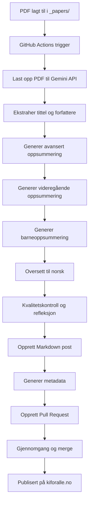

# Kiforalle.no

En nettside som oppsummerer utvalgt AI-forskning på tre nivåer: for barn, for videregåendeelever og for universitets-/høyskolenivå.

## Funksjoner

- **🤖 Automatisk oppsummering**: Bruker Google Gemini API for å generere oppsummeringer av forskningsartikler på tre nivåer
- **🇳🇴 Norske oppsummeringer**: Alle oppsummeringer oversettes til høykvalitets norsk med passende språknivå
- **📑 Fane-basert visning**: Interaktiv fane-layout som lar brukere bytte mellom de tre nivåene
- **🔄 Automatisk publisering**: GitHub Actions automatiserer både oppsummering og publisering
- **📱 Responsivt design**: Basert på Jekyll og Minima-tema for mobilvennlig visning
- **✅ Kvalitetskontroll**: Automatisk refleksjon og validering av generert innhold
- **📊 Metadata-ekstrahering**: Automatisk utvinning av tittel, forfattere og paper ID

## Slik legger du til en ny artikkel

### Automatisk metode (anbefalt)
1. **Legg til PDF-fil**: Plasser PDF-filen av forskningsartikkelen i `_papers`-mappen
2. **Push til GitHub**: Commit og push endringene til repository
3. **Automatisk prosessering**: GitHub Actions starter automatisk og:
   - Laster opp PDF-en til Google Gemini API
   - Ekstraherer tittel og forfattere fra artikkelen
   - Genererer tre nivåer av oppsummeringer på engelsk
   - Oversetter alle oppsummeringer til norsk
   - Utfører kvalitetskontroll og refleksjon
   - Oppretter en profesjonell pull request med metadata
4. **Gjennomgang og publisering**: Gjennomgå PR-en og merge for å publisere

### Manuell metode
Du kan også kjøre prosessen manuelt via GitHub Actions:
1. Gå til "Actions" i GitHub repository
2. Velg "Summarize Paper" workflow
3. Klikk "Run workflow" og angi stien til PDF-filen
4. Workflows vil prosessere filen og opprette en pull request

### Detaljert automatiseringsprosess

#### Steg 1: Innholdsgenerering
- **Avansert oppsummering**: Comprehensive akademisk sammendrag (300-500 ord)
- **Videregående oppsummering**: Forenklet for ungdom 16-18 år (200-300 ord)  
- **Barneoppsummering**: Enkelt språk med analogier (100-150 ord)

#### Steg 2: Oversettelse til norsk
- Hver oppsummering oversettes til høykvalitets norsk
- Beholder passende språknivå for hver målgruppe
- Bruker norsk terminologi og uttrykk

#### Steg 3: Kvalitetskontroll
- Automatisk refleksjon og kvalitetsvurdering
- Sammenligner alle nivåer for konsistens
- Verifiserer at innholdet er nøyaktig og passende

#### Steg 4: Pull Request-generering
- Oppretter PR med artikkelens faktiske tittel
- Inkluderer metadata (forfattere, paper ID, filsti)
- Detaljert beskrivelse av prosessen og innhold
- Profesjonell formatering med emojis og seksjoner

## Teknisk arkitektur

### Komponenter
- **Jekyll**: Statisk nettside generator
- **Minima**: Jekyll-tema for grunnleggende styling
- **Google Gemini API**: AI-modell for oppsummering av PDF-er
- **GitHub Actions**: CI/CD for automatisk oppsummering og publisering
- **Python**: Automatiseringsscript for prosessering av PDF-er

### Filstruktur
```
├── _layouts/
│   └── tabbed_post.html     # Layout for fane-baserte artikler
├── _papers/                 # PDF-filer av forskningsartikler
├── _posts/                  # Genererte norske oppsummeringer
├── .github/
│   ├── scripts/
│   │   ├── summarize.py     # Python-script for oppsummering
│   │   └── requirements.txt # Python-avhengigheter
│   └── workflows/
│       ├── summarize.yml    # Workflow for oppsummering
│       └── jekyll.yml       # Workflow for publisering
└── _config.yml              # Jekyll-konfigurasjon
```

### Automatiseringsworkflow


## Utvikling

### Lokalt miljø

#### Forutsetninger
- Ruby (versjon 2.7 eller nyere)
- Bundler gem

#### Installasjon og kjøring
```bash
# Installer avhengigheter
bundle install

# Kjør Jekyll lokalt
bundle exec jekyll serve --host 0.0.0.0 --port 4000

# Nettstedet er tilgjengelig på http://localhost:4000
```

#### Tilgang til artikler
- Besøk `http://localhost:4000/ai/forskning/2025/07/05/2505.22954v1.html` for å se eksempelartikkel
- Fane-funksjonaliteten lar deg bytte mellom de tre nivåene av oppsummeringer

#### Debugging
- Hvis fanene ikke viser innhold, sjekk at JavaScript kjører i nettleseren
- Kontroller at Jekyll har bygget siden riktig ved å se i `_site`-mappen

### Miljøvariabler
- `GEMINI_API_KEY`: Google Gemini API-nøkkel for oppsummering (kreves for GitHub Actions)

### Debugging av automatiseringsworkflow
GitHub Actions gir detaljert logging for hver kjøring:

1. **Gå til Actions-fanen** i GitHub repository
2. **Velg en workflow-kjøring** for å se detaljerte logger
3. **Kjente problemer og løsninger**:
   - **API-feil**: Sjekk at `GEMINI_API_KEY` er korrekt satt som repository secret
   - **PDF-parsing feil**: Kontroller at PDF-filen ikke er skadet eller passordbeskyttet
   - **Oversettelse feil**: Gemini API kan noen ganger ha problemer med lange tekster
   - **Metadata-ekstrahering feil**: Sjekk at tittel og forfattere kan ekstraheres fra PDF-en

### Logging og feilsøking
Automatiseringsscriptet gir omfattende logging:
- **Seksjonierte logger** med `===` headers for lett navigering
- **API-kall detaljer** med prompt-lengder og respons-forhåndsvisninger
- **Feilhåndtering** med try-catch blokker for alle operasjoner
- **Fil-verifisering** med størrelse og eksistens-sjekker
- **Prosess-sporing** med detaljert steg-for-steg logging

## Status

- [x] Sett opp Jekyll-tema og grunnleggende sidestruktur
- [x] Lag en innholdsstruktur for de tre nivåene av oppsummeringer
- [x] Implementer komplett `summarize.py`-script med Google Gemini API
- [x] Komplett `tabbed_post.html`-layout med JavaScript-funksjonalitet
- [x] GitHub Actions for automatisk oppsummering og publisering
- [x] Første oppsummering publisert (2505.22954v1.pdf)
- [x] **Forbedret automatiseringssystem med norske oppsummeringer**
- [x] **Avansert prompt-system med engelsk→norsk oversettelse**
- [x] **Kvalitetskontroll og refleksjon av generert innhold**
- [x] **Omfattende logging og feilhåndtering**
- [x] **Forbedret PR-generering med metadata og profesjonell formatering**
- [ ] Oversett siden til norsk (delvis gjort)
- [ ] Sett opp tilpasset domene `kiforalle.no`

## Fremtidige forbedringer

### Høy prioritet
- **Forbedre mobilresponsivt design**: Optimalisere fane-layouten for mobile enheter
- **Implementer caching**: Redusere API-kall ved å cache oppsummeringer
- **Utvidet metadata**: Automatisk ekstrahere publiseringsdato og journal fra PDF-er
- **Batch-prosessering**: Støtte for å prosessere flere PDF-er samtidig

### Mellom prioritet
- **Søkefunksjon**: Implementer søk i titler og innhold
- **Kategorisering**: Legg til emnetagging (maskinlæring, computer vision, NLP, etc.)
- **RSS-feed**: Automatisk RSS-feed for nye oppsummeringer
- **Kommentarfunksjon**: Legg til kommentarfelt for diskusjon

### Lav prioritet
- **Bildehandtering**: Ekstrahere og vise figurer fra PDF-er
- **Statistikk**: Analysere lesemønstre og populære artikler
- **API-endepunkter**: REST API for ekstern tilgang til oppsummeringer
- **Favorittsystem**: La brukere markere og lagre favorittartikler
- **Sosial deling**: Integrere delingsknapper for sosiale medier
- **Flerspråklig støtte**: Støtte for andre språk i tillegg til norsk

## Bidrag

Bidrag er velkomne! Vennligst opprett en issue eller pull request for forbedringer eller feilrettinger.

## Lisens

Dette prosjektet er lisensiert under MIT-lisensen.
